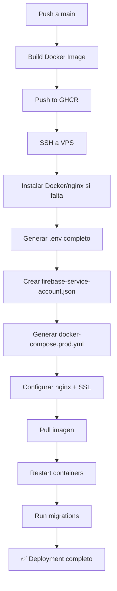

# 🚀 Deployment 100% Automatizado - AsistApp

Este documento explica cómo tener un deployment completamente automatizado que funcione en **cualquier VPS nueva** sin configuración manual.

## ✅ **Estado Actual**

El workflow de GitHub Actions YA está configurado para:
- ✅ Instalar Docker, nginx, certbot automáticamente
- ✅ Configurar certificados SSL automáticamente
- ✅ Generar archivo `.env` completo con todas las variables
- ✅ Configurar Firebase Service Account automáticamente
- ✅ Configurar WhatsApp API automáticamente
- ✅ Construir y desplegar el backend
- ✅ Ejecutar migraciones de base de datos

## 📋 **Configuración ÚNICA (Una sola vez)**

Solo necesitas configurar los **GitHub Secrets** UNA VEZ. Después, todo es automático.

### **1. Secrets Obligatorios (Ya configurados ✅)**

Estos ya los tienes:
- `VPS_HOST` ✅
- `VPS_USER` ✅  
- `SSH_PRIVATE_KEY` ✅
- `DOMAIN` ✅
- `EMAIL` ✅
- `DB_USER` ✅
- `DB_PASS` ✅
- `DB_NAME` ✅
- `DB_PORT` ✅
- `JWT_SECRET` ✅

### **2. Secrets Opcionales (FALTANTES ❌)**

Estos son los que faltan y DEBES configurar:

#### **WhatsApp Cloud API:**
Ve a: https://github.com/yamidnozu/asistapp/settings/secrets/actions

| Secret Name | Valor | Cómo obtenerlo |
|------------|-------|----------------|
| `WHATSAPP_API_TOKEN` | `EAATWH2LvOj8BQPqDVeIjbdtAMXZBmtXtCZBZB3ICnnMxoPCWqIhCE5IbGZCYA7iq2wAoqKZBuxNtjUcIadhTkfVEL8tGHywK5dbPPlcYFBbJrllsFoopzw3rUm03Aflv5TuPbb00UaODsW3BeiBjUYqpqwZC7YrCVfuHh0yxYPaSMGoDD5iBnsb1818Axp4RCmHOfKv84ZCtBmk` | Ya lo tienes |
| `WHATSAPP_PHONE_NUMBER_ID` | `947476001773627` | Ya lo tienes |
| `WHATSAPP_BUSINESS_ACCOUNT_ID` | `840929655333048` | Ya lo tienes |

#### **Firebase (Push Notifications):**

| Secret Name | Valor | Cómo obtenerlo |
|------------|-------|----------------|
| `FIREBASE_PROJECT_ID` | `asistapp-1c728` | Ya lo sabes |
| `FIREBASE_SERVICE_ACCOUNT_JSON` | JSON completo | Ver abajo ⬇️ |

**Para obtener `FIREBASE_SERVICE_ACCOUNT_JSON`:**
1. Ve a: https://console.firebase.google.com/project/asistapp-1c728/settings/serviceaccounts/adminsdk
2. Click en **"Generar nueva clave privada"**
3. Se descarga un archivo JSON
4. Copia **TODO** el contenido del JSON (desde `{` hasta `}`)
5. Pégalo como valor del secret en GitHub

---

## 🎯 **Cómo Desplegar a una VPS Nueva (AUTOMATIZADO)**

### **Opción 1: Nueva VPS desde cero**

1. **Crea una VPS con Ubuntu 24.04**
2. **Apunta un dominio/subdominio a la IP de la VPS**
3. **Actualiza los secrets en GitHub:**
   - `VPS_HOST`: Nueva IP o dominio
   - `DOMAIN`: Nuevo dominio
   - `SSH_PRIVATE_KEY`: Nueva clave SSH (si cambió)
4. **Push a main:**
   ```bash
   git push origin main
   ```
5. **¡LISTO!** En 5-10 minutos tu app está desplegada ✅

### **Opción 2: Re-desplegar en VPS existente**

Simplemente haz push a main:
```bash
git push origin main
```

El workflow automáticamente:
1. ✅ Construye la imagen Docker
2. ✅ La sube a GitHub Container Registry
3. ✅ Se conecta a la VPS por SSH
4. ✅ Actualiza el archivo `.env` con todas las variables
5. ✅ Crea el archivo `firebase-service-account.json`
6. ✅ Actualiza `docker-compose.prod.yml`
7. ✅ Baja la última imagen
8. ✅ Reinicia los contenedores
9. ✅ Ejecuta migraciones de BD

**Todo sin tocar el servidor.**

---

## 🔍 **Validar que Todo Funciona**

### **Desde GitHub:**
Ve a: https://github.com/yamidnozu/asistapp/actions
- Verifica que el workflow terminó exitosamente ✅

### **Desde tu navegador:**
- Prueba: https://srv974201.hstgr.cloud/health
- Deberías ver: `{"success":true,"status":"healthy"}`

### **Desde SSH (opcional):**
```bash
ssh root@srv974201.hstgr.cloud
curl http://localhost:3000/health
docker ps
docker logs backend-app-v3
```

---

## 🚨 **Solución de Problemas**

### **"Variables de WhatsApp vacías"**
→ Configura los secrets `WHATSAPP_API_TOKEN`, `WHATSAPP_PHONE_NUMBER_ID`, `WHATSAPP_BUSINESS_ACCOUNT_ID`

### **"Firebase credentials NO montado"**
→ Configura el secret `FIREBASE_SERVICE_ACCOUNT_JSON`

### **"Backend unhealthy pero HTTPS funciona"**
→ Esto es normal, el healthcheck del contenedor puede fallar pero el backend funciona correctamente

### **"502 Bad Gateway"**
→ El backend está arrancando, espera 30-60 segundos

---

## 📊 **Lo que el Workflow Hace Automáticamente**



---

## 🎁 **Beneficios**

✅ **Zero downtime deployment**: El workflow espera a que la BD esté healthy antes de levantar el backend
✅ **Configuración centralizada**: Todo en GitHub Secrets
✅ **Portable**: Cambia de VPS en minutos, solo actualizando 2-3 secrets
✅ **Seguro**: Las credenciales nunca se suben al repo
✅ **Idempotente**: Puedes ejecutar el workflow múltiples veces sin problemas
✅ **Rollback automático**: Si falla, los contenedores viejos siguen corriendo

---

## 🔄 **Migrar a Otra VPS (Paso a Paso)**

1. **Crear nueva VPS Ubuntu 24.04**
2. **Configurar DNS** (apuntar dominio a nueva IP)
3. **Generar nueva SSH key:**
   ```bash
   ssh-keygen -t ed25519 -C "deploy-asistapp-new" -f ~/.ssh/asistapp_new
   ssh-copy-id -i ~/.ssh/asistapp_new.pub root@NUEVA_IP
   ```
4. **Actualizar secrets en GitHub:**
   - `VPS_HOST`: Nueva IP
   - `DOMAIN`: Nuevo dominio (si cambió)
   - `SSH_PRIVATE_KEY`: Contenido de `~/.ssh/asistapp_new`
5. **Hacer push:**
   ```bash
   git commit --allow-empty -m "deploy: migrate to new VPS"
   git push origin main
   ```
6. **Esperar 5-10 minutos**
7. **✅ Listo!**

---

## 🎯 **Próximos Pasos AHORA**

1. **Configura los 5 secrets faltantes:**
   - `WHATSAPP_API_TOKEN`
   - `WHATSAPP_PHONE_NUMBER_ID`
   - `WHATSAPP_BUSINESS_ACCOUNT_ID`
   - `FIREBASE_PROJECT_ID`
   - `FIREBASE_SERVICE_ACCOUNT_JSON`

2. **Trigger el workflow:**
   ```bash
   git commit --allow-empty -m "trigger: configure all secrets"
   git push origin main
   ```

3. **Monitorea en:**
   https://github.com/yamidnozu/asistapp/actions

4. **Verifica que todo funciona:**
   https://srv974201.hstgr.cloud/health

---

## 📞 **Soporte**

Si algo falla:
1. Ve a GitHub Actions y revisa los logs del workflow
2. Busca líneas con "❌" o "ERROR"
3. Verifica que todos los secrets estén configurados
4. Comprueba que la VPS tiene puertos 80/443 abiertos

**¡Ya tienes deployment 100% automatizado!** 🎉
