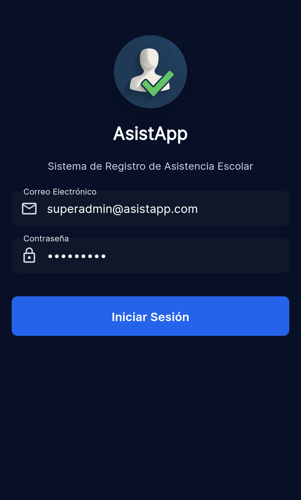
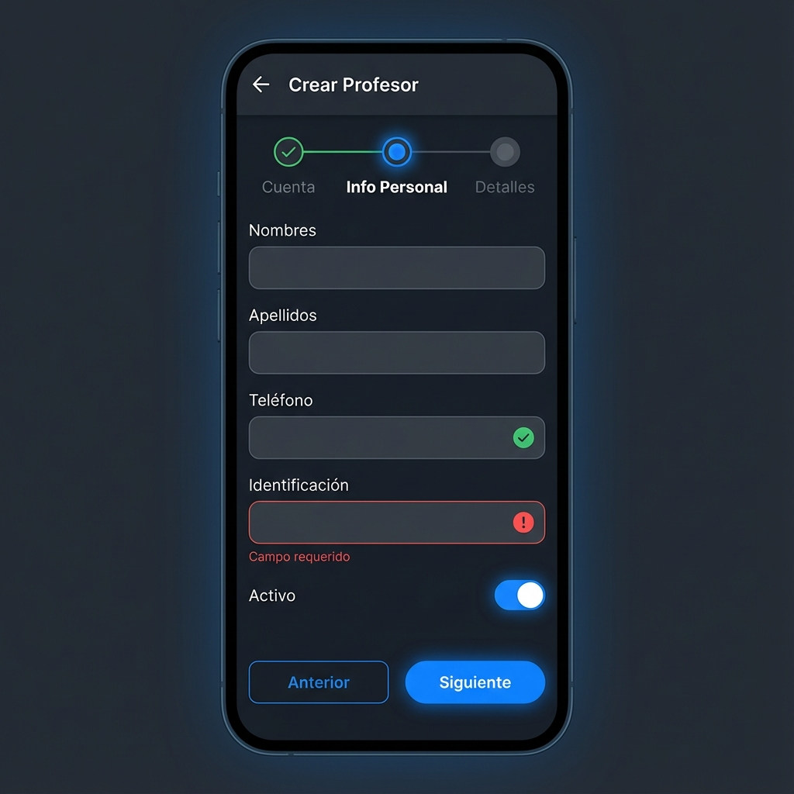
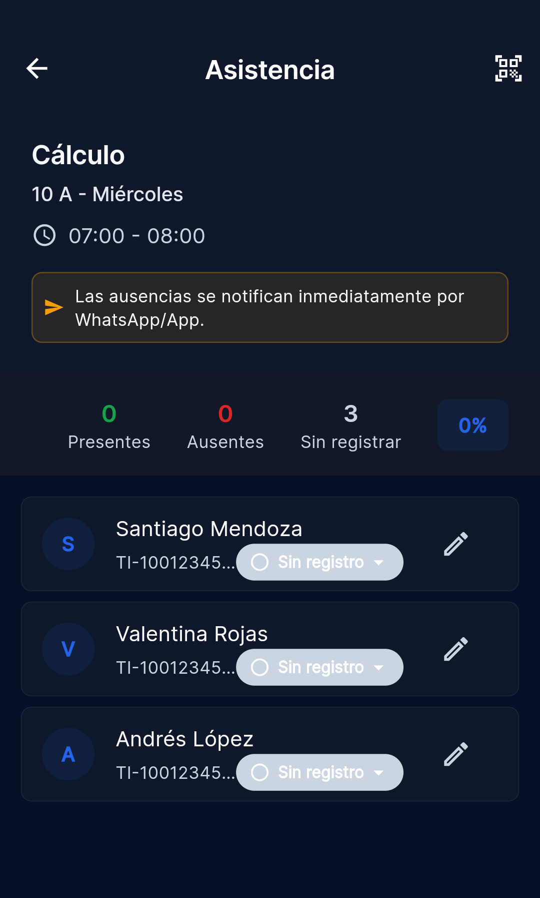
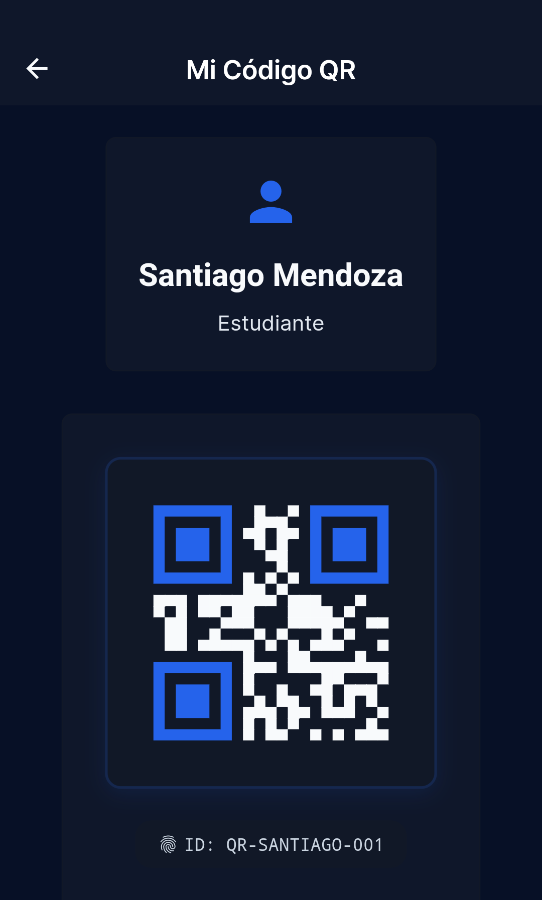
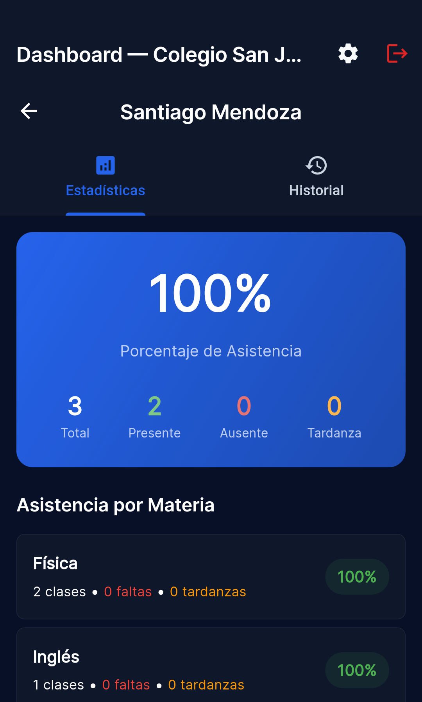
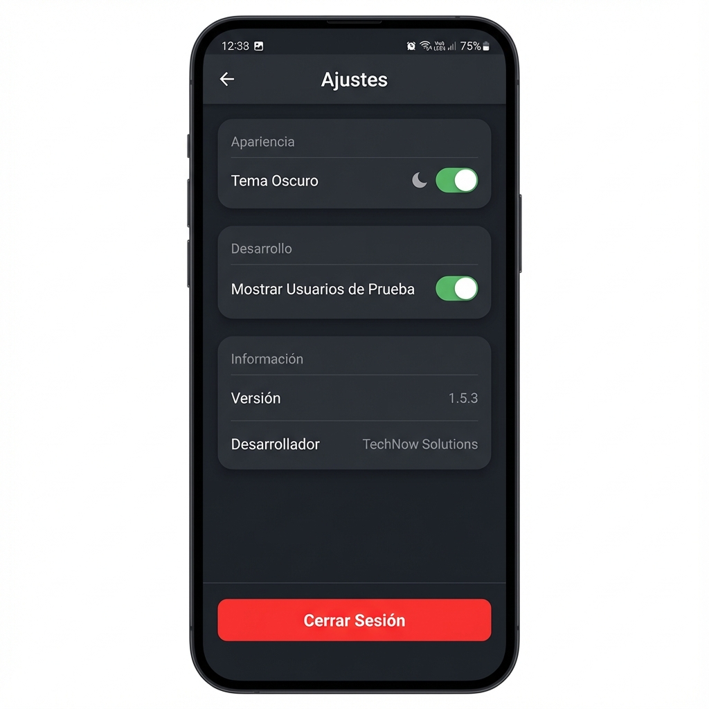

# Manual de Usuario - AsistApp

**Versión del Sistema:** 1.5.3  
**Última Actualización:** Diciembre 2025

---

## Tabla de Contenidos

1.  [Introducción](#1-introducción)
2.  [Acceso al Sistema](#2-acceso-al-sistema)
3.  [Descripción de Roles](#3-descripción-de-roles)
4.  [Módulo: Super Administrador](#4-módulo-super-administrador)
5.  [Módulo: Administrador de Institución](#5-módulo-administrador-de-institución)
6.  [Módulo: Profesor](#6-módulo-profesor)
7.  [Módulo: Estudiante](#7-módulo-estudiante)
8.  [Módulo: Acudiente (Padre/Tutor)](#8-módulo-acudiente-padretutor)
9.  [Configuración General](#9-configuración-general)
10. [Preguntas Frecuentes (FAQ)](#10-preguntas-frecuentes-faq)

---

## 1. Introducción

Bienvenido a **AsistApp**, la solución integral inteligente para la gestión de asistencia y seguimiento académico. Esta guía está diseñada para ayudarle a navegar por todas las funcionalidades de la aplicación de manera eficiente, asegurando una experiencia fluida para administradores, docentes, estudiantes y familias.

### Lo que puede hacer con AsistApp:
*   **Gestión en Tiempo Real:** Controle la asistencia y estadísticas al instante.
*   **Tecnología QR:** Agilice el ingreso con códigos QR únicos por estudiante.
*   **Comunicación Directa:** Notificaciones automáticas a acudientes vía WhatsApp y App.
*   **Flexibilidad:** Adaptable a diferentes estructuras académicas y horarios.

---

## 2. Acceso al Sistema

### Iniciar Sesión

Para acceder a las funcionalidades de AsistApp, debe autenticarse con sus credenciales institucionales.

1.  Abra la aplicación AsistApp en su dispositivo.
2.  Escriba su **Correo Electrónico** institucional.
3.  Escriba su **Contraseña** segura.
4.  Presione el botón **"Iniciar Sesión"**.

> **Nota:** Si es su primera vez ingresando u olvidó su contraseña, contacte al Administrador de su Institución. El sistema de recuperación de contraseña se gestiona internamente por seguridad.

---

## 3. Descripción de Roles

La aplicación adapta dinámicamente su interfaz según su perfil de usuario:

| Rol | Responsabilidad Principal |
| :--- | :--- |
| **Super Administrador** | Gestión global de la plataforma, instituciones y administradores. |
| **Admin. Institución** | Configuración académica (horarios, grupos) y gestión de usuarios del colegio. |
| **Profesor** | Toma de asistencia diaria, gestión de clases y reporte de novedades. |
| **Estudiante** | Consulta de horarios, visualización de código QR y monitoreo de asistencia personal. |
| **Acudiente** | Seguimiento de la asistencia sus hijos y recepción de notificaciones. |

---

## 4. Módulo: Super Administrador

**¿Para quién es esto?** Exclusivo para el personal técnico o administrativo global de la plataforma AsistApp.

### 4.1 Panel de Control (Dashboard)

Su centro de mando para supervisar la salud y métricas de toda la plataforma.

*   **KPIs en vivo:** Visualice el total de instituciones y usuarios registrados.
*   **Accesos Rápidos:** Navegue instantáneamente a la gestión de Instituciones o Usuarios Globales.

### 4.2 Gestión de Instituciones

Administre el ciclo de vida de los colegios registrados en la plataforma.

#### Crear Nueva Institución
1.  Presione el botón flotante **+** en la esquina inferior.
2.  Complete el asistente de creación de 3 pasos:
    *   **Paso 1 (Básico):** Nombre y Código único de la institución.
    *   **Paso 2 (Contacto):** Dirección física, teléfonos y correo de contacto.
    *   **Paso 3 (Configuración):** Defina el canal de notificaciones (WhatsApp/Push) y la frecuencia (Inmediata/Fin del día).
3.  Presione **"Guardar"** para finalizar.

#### Opciones de Institución
Deslice una institución en la lista o tóquela para ver opciones:
*   **Editar:** Actualice datos de contacto o configuración.
*   **Admins:** Gestione los usuarios administradores asignados a esta sede.
*   **Desactivar:** Restrinja el acceso temporalmente a una institución.

### 4.3 Gestión de Usuarios Globales

Administre cuentas de otros Super Administradores o Administradores de Institución.

*   **Crear Usuario:** Botón **+** > Seleccione "Super Admin" o "Admin Institución".
*   **Restablecer Clave:** Acceda al detalle del usuario y use el botón de **"Regenerar Contraseña"**.

---

## 5. Módulo: Administrador de Institución

**¿Para quién es esto?** Rectores, coordinadores o secretarios encargados de la configuración académica del colegio.

### 5.1 Panel Académico

Un resumen operativo de su institución.

Desde aquí puede gestionar los 3 pilares académicos: **Usuarios**, **Grupos** y **Horarios**.

### 5.2 Gestión de Usuarios (Comunidad Educativa)

Centralice la administración de Profesores, Estudiantes y Acudientes.

#### Crear Usuario
1.  Vaya a la sección **Usuarios** y presione **+**.
2.  Seleccione el rol: **Profesor**, **Estudiante** o **Acudiente**.
3.  Diligencie los datos personales:
    *   *Importante:* Para **Estudiantes**, el documento de identidad es obligatorio (vinculado al QR).
    *   *Importante:* Para **Profesores**, debe asignar un Título (ej: Licenciado) y Especialidad.
4.  Al guardar, el sistema generará una **Contraseña Temporal**.
    > **Atención:** Copie y entregue esta contraseña al usuario inmediatamente. No podrá verla de nuevo.

#### Vincular Acudientes (Familias)
Para conectar un padre con un estudiante:
1.  Edite el perfil del **Estudiante**.
2.  Busque el botón **"Gestionar Acudientes"**.
3.  Busque al acudiente por email o cree uno nuevo.
4.  Defina el parentesco (Padre, Madre, etc.) y presione **"Vincular"**.

### 5.3 Estructura Académica (Grupos y Horarios)

Configure dónde y cuándo suceden las clases.

#### Grupos
Defina los salones (ej: 6A, 11B).
1.  Sección **Grupos** > Botón **+**.
2.  Asigne nombre, grado y convención.
3.  Una vez creado, toque el grupo para **asignar estudiantes** masivamente desde la lista global.

#### Horarios y Clases
El corazón de la asistencia. Sin horarios, los profesores no verán clases.

1.  Vaya a **Horarios**.
2.  Seleccione el **Grupo** y el **Período Académico**.
3.  Toque un espacio vacío en el calendario o el botón **+**.
4.  **Configure la Clase:**
    *   **Materia:** Seleccione de la lista (ej: Matemáticas).
    *   **Profesor:** Asigne el docente encargado.
    *   **Hora:** Defina inicio y fin.
    > **Smart Check:** El sistema le alertará si el profesor o el grupo ya tienen otra clase a esa hora.

---

## 6. Módulo: Profesor

**¿Para quién es esto?** Docentes que dictan clase y registran asistencia.

### 6.1 Mi Agenda del Día

Al ingresar, verá inmediatamente sus **"Clases de Hoy"** ordenadas cronológicamente.

### 6.2 Toma de Asistencia

Seleccione una clase activa para abrir la lista de estudiantes.

Tiene múltiples formas de registrar la asistencia para máxima velocidad:

#### Opción A: Gestos Rápidos (Swipe)
*   **Deslizar derecha:** Presente.
*   **Deslizar izquierda:** Ausente.

#### Opción B: Escáner QR
1.  Toque el icono de **QR** en la barra superior.
2.  Escanee el código del estudiante.
3.  ¡Listo! Se marca Presente y se confirma con sonido/vibración.

#### Opción C: Edición Manual
Toque el nombre de un estudiante para cambiar su estado detallado:
*   **Presente**
*   **Ausente**
*   **Tardanza** (Llegada tarde)
*   **Justificado** (Falta con excusa)

> **Notificaciones:** Dependiendo de la configuración del colegio, las notificaciones a los padres se enviarán al marcar la ausencia o al finalizar el día escolar.

---

## 7. Módulo: Estudiante

**¿Para quién es esto?** Alumnos que desean monitorear su actividad.

### 7.1 Mi Perfil Estudiantil

Mantenga el control de su desempeño con métricas claras:
*   **Resumen de Asistencia:** Un gráfico circular le muestra su porcentaje global.
    *   >80%: Excelente.
    *   60-80%: Atención.
    *   <60%: Crítico.

### 7.2 Herramientas
*   **Mi Horario:** Consulte qué clases tiene hoy y mañana.
*   **Mi QR:** (Ver imagen abajo) Su llave de entrada. Muéstrelo al profesor para registrar asistencia en segundos.

---

## 8. Módulo: Acudiente (Padre/Tutor)

**¿Para quién es esto?** Padres y tutores que desean estar informados en tiempo real.

### 8.1 Monitoreo de Hijos

Vea a todos sus hijos vinculados en una sola pantalla.

Cada tarjeta de hijo le resume:
*   Asistencia promedio.
*   Faltas acumuladas este período.

### 8.2 Detalles y Novedades

Toque sobre un hijo para ver el detalle profundo:
*   **Historial:** Lista fecha por fecha de cada clase asistida o fallada.
*   **Por Materia:** ¿Está fallando solo en Matemáticas? Descúbralo aquí.

### 8.3 Centro de Notificaciones

Reciba alertas sobre:
*   Ausencias injustificadas.
*   Llegadas tarde.
*   Comunicados institucionales importantes.

Las notificaciones pueden llegarle como **Push** (en la app) o mensajes de **WhatsApp** si su institución lo tiene habilitado.

---

## 9. Configuración General

Accesible desde el menú inferior "Ajustes":
*   **Modo Oscuro:** Active una interfaz descansada para la vista en entornos de poca luz.
*   **Cerrar Sesión:** Desconéctese de forma segura al terminar.

---

## 10. Preguntas Frecuentes (FAQ)

**P: Olvidé mi contraseña, ¿cómo la recupero?**
R: Por seguridad, AsistApp no tiene autoreset público. Contacte a la secretaría o administrador de sistemas de su colegio para que le generen una clave temporal.

**P: El profesor dice que falté pero yo estaba allí.**
R: Puede ocurrir un error humano. Pida a su acudiente que revise la App. Si aparece "Ausente", hable con el profesor en la siguiente clase para que ajuste el registro a "Justificado" o "Presente".

**P: ¿Por qué no me llegan los WhatsApps?**
R: Verifique dos cosas: 1) Que su número celular en la base de datos del colegio esté actualizado y tenga el código de país (+57...). 2) Que el colegio tenga contratado y activo el paquete de notificaciones WhatsApp.

**P: Soy profesor, ¿puedo cambiar una asistencia de ayer?**
R: Sí, mientras el período académico esté abierto. Busque la clase en el historial o calendario y edite los registros necesarios.

---
*© 2025 AsistApp - Tecnología para la Educación.*
