# Manual de Usuario - AsistApp

**Versión:** 1.4.11  
**Fecha:** Diciembre 2025

---

## Índice

1. [Introducción](#1-introducción)
2. [Acceso a la Aplicación](#2-acceso-a-la-aplicación)
3. [Roles de Usuario](#3-roles-de-usuario)
4. [Super Administrador](#4-super-administrador)
5. [Administrador de Institución](#5-administrador-de-institución)
6. [Profesor](#6-profesor)
7. [Estudiante](#7-estudiante)
8. [Acudiente (Padre/Tutor)](#8-acudiente-padretutor)
9. [Configuración y Ajustes](#9-configuración-y-ajustes)
10. [Preguntas Frecuentes](#10-preguntas-frecuentes)

---

## 1. Introducción

Bienvenido a **AsistApp**, el sistema integral para la gestión de asistencia escolar. Esta aplicación móvil está diseñada para facilitar el registro, seguimiento y notificación de la asistencia de los estudiantes en instituciones educativas.

### Características Principales
- ✅ Registro de asistencia manual y por código QR
- 📊 Estadísticas de asistencia en tiempo real
- 📱 Notificaciones automáticas a padres/tutores
- 📅 Gestión de horarios y grupos académicos
- 👥 Gestión de usuarios por rol

---

## 2. Acceso a la Aplicación

### Pantalla de Inicio de Sesión

Al abrir la aplicación, verá la pantalla de inicio de sesión donde debe ingresar sus credenciales institucionales.

**Pasos para iniciar sesión:**
1. Ingrese su **Correo electrónico** institucional
2. Ingrese su **Contraseña**
3. Presione el botón **"Iniciar Sesión"**

> **Nota:** Si olvidó su contraseña, contacte al administrador de su institución.

---

## 3. Roles de Usuario

AsistApp adapta su interfaz según el rol asignado:

| Rol | Descripción | Acceso Principal |
|-----|-------------|------------------|
| **Super Administrador** | Gestión global del sistema | Instituciones, Usuarios globales |
| **Administrador de Institución** | Gestión de una institución específica | Usuarios, Grupos, Horarios, Materias |
| **Profesor** | Registro de asistencia | Dashboard de clases, Toma de asistencia |
| **Estudiante** | Consulta personal | Mi QR, Mi Horario, Mi Asistencia |
| **Acudiente** | Monitoreo de acudidos | Ver hijos, Notificaciones |

---

## 4. Super Administrador

El Super Administrador tiene control total sobre el sistema, incluyendo la gestión de todas las instituciones y usuarios administrativos.

### 4.1 Panel Principal (Dashboard)

Al iniciar sesión como Super Admin, verá el panel principal con un resumen del sistema.

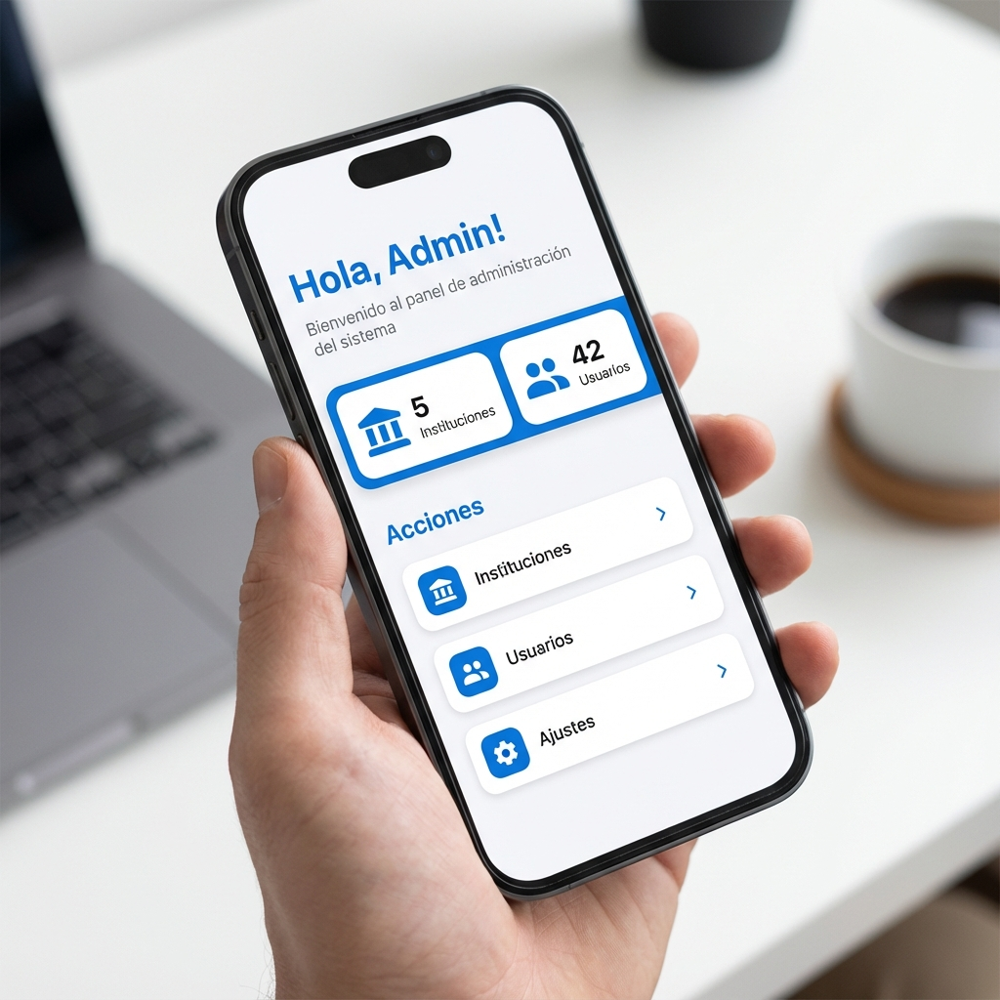

**Elementos del dashboard:**
- **Saludo personalizado** con su nombre
- **KPIs (Indicadores clave):**
  - Total de Instituciones registradas
  - Total de Usuarios en el sistema
- **Acciones Principales:**
  - Instituciones: Gestión completa de colegios/instituciones
  - Usuarios: Administradores de institución y Super Admins
  - Ajustes: Configuración del sistema

### 4.2 Gestión de Instituciones

Acceda a esta sección para crear, editar o desactivar instituciones educativas.

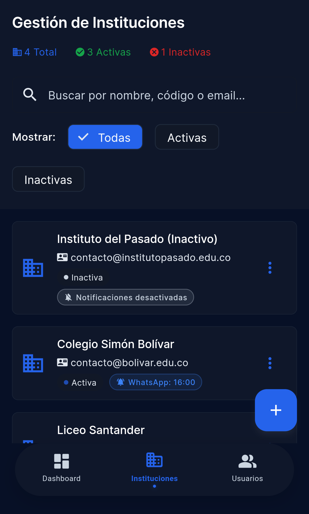

**Funcionalidades:**
1. **Búsqueda:** Use la barra superior para buscar por nombre, código o email
2. **Filtros:** 
   - Todas
   - Activas
   - Inactivas
3. **Estadísticas:** Vea el total de instituciones activas e inactivas
4. **Acciones por institución:**
   - Editar información
   - Crear administrador
   - Gestionar administradores
   - Activar/Desactivar
   - Eliminar

**Para crear una nueva institución:**
1. Presione el botón flotante **"+"** en la esquina inferior derecha
2. Complete el formulario (3 pasos):

*Paso 1 - Información Básica:*
- Nombre de la institución
- Código institucional

*Paso 2 - Contacto:*
- Dirección
- Teléfono
- Email

*Paso 3 - Configuración:*
- **Estado:** Activa/Inactiva
- **Notificaciones:** Activar o desactivar
- **Canal de notificación:**
  - WhatsApp
  - Push (notificación en app)
  - Ambos
- **Modo de envío:**
  - Manual (con botón del profesor)
  - Inmediato (automático al registrar ausencia)
  - Fin del día (consolidado a hora específica)
- **Hora de envío:** (solo para modo "Fin del día")

3. Presione **"Guardar"**

### 4.3 Gestión de Usuarios (Super Admin)

Administre los usuarios con roles de Super Admin y Administrador de Institución.

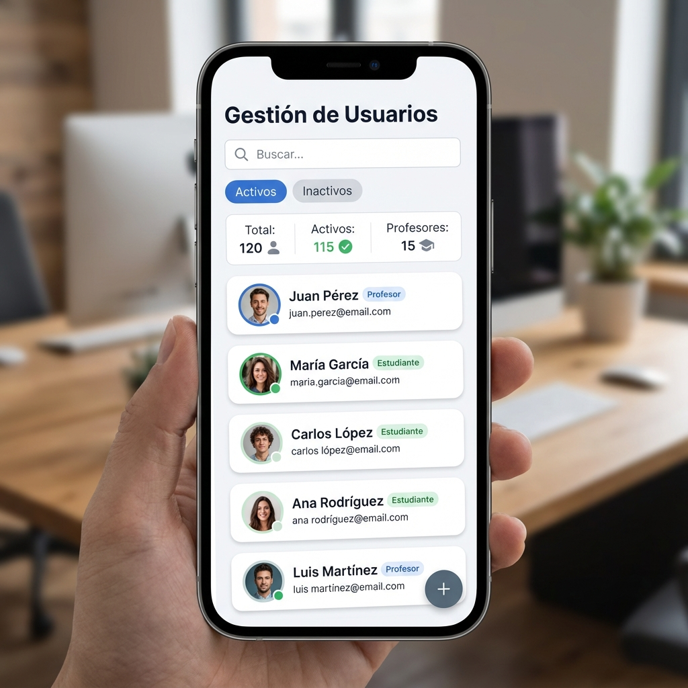

**Funcionalidades:**
- **Búsqueda:** Por nombre, email o teléfono
- **Filtros:**
  - Por estado: Activos / Inactivos / Todos
  - Por rol: Todos / Admins Institución / Super Admins
- **Estadísticas:** Total, Activos, por tipo de rol

**Para crear un nuevo usuario administrativo:**
1. Presione el botón flotante **"+"**
2. Seleccione el tipo de usuario:
   - Crear Admin Institución
   - Crear Super Admin
3. Complete el formulario con los datos requeridos
4. Presione **"Guardar"**

### 4.4 Gestión de Administradores por Institución

Desde la lista de instituciones, puede gestionar los administradores de cada una:

1. Seleccione una institución → **"Gestionar Admins"**
2. Verá la lista de administradores asignados

**Opciones disponibles:**
- **Crear Nuevo Administrador:** Abre el formulario de usuario
- **Asignar Usuario Existente:** Busca administradores existentes para asignarlos

**Cambiar contraseña de administrador:**
1. En la tarjeta del administrador, presione el ícono de **llave**
2. Ingrese la nueva contraseña (mínimo 8 caracteres)
3. Confirme la contraseña
4. Presione **"Guardar"**

**Remover administrador:**
- Presione el ícono **rojo** de remover
- Confirme la acción

### 4.5 Detalle de Usuario

Al seleccionar un usuario de la lista, accede a su detalle completo:

**Información mostrada:**
- Datos básicos (nombres, email, teléfono, rol, estado)
- Información específica del rol (título, especialidad para profesores)
- Código QR e información del responsable (para estudiantes)
- Instituciones asignadas
- Información del sistema (ID, fecha de creación)

**Acciones disponibles:**
- **Gestionar Acudientes:** (solo estudiantes) Abre el panel de vinculación
- **Regenerar Contraseña:** Genera una nueva contraseña temporal

---

## 5. Administrador de Institución

El Administrador de Institución gestiona todos los aspectos académicos de su colegio asignado.

### 5.1 Panel Principal

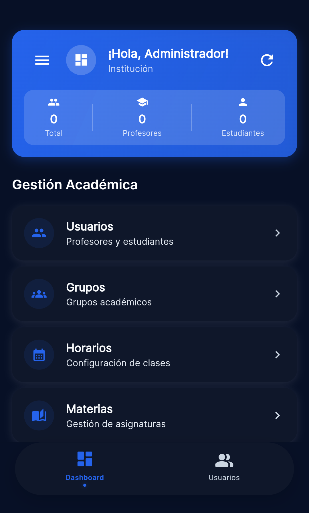

**Elementos del dashboard:**
- **Saludo personalizado**
- **KPIs:**
  - Total de Usuarios de la institución
  - Número de Profesores
  - Número de Estudiantes
- **Acciones Principales:**
  - Usuarios: Gestión de profesores, estudiantes y acudientes
  - Grupos: Gestión de grupos/grados académicos
  - Horarios: Configuración de horarios de clases
  - Ajustes: Configuración de la institución

### 5.2 Gestión de Usuarios

Administre profesores, estudiantes y acudientes de su institución.

**Para crear usuarios:**
1. Presione el botón flotante **"+"**
2. Seleccione el tipo:
   - **Crear Profesor:** Docentes que tomarán asistencia
   - **Crear Estudiante:** Alumnos con código QR asignado
   - **Crear Acudiente:** Padres/tutores que recibirán notificaciones

**Formulario de creación (3 pasos):**

*Paso 1 - Cuenta:*
- Email del usuario
- Institución (se preselecciona la actual)

*Paso 2 - Información Personal:*
- Nombres y Apellidos (requeridos, mínimo 2 caracteres)
- Teléfono (formato: +57 300 123 4567)
- Identificación (requerida para estudiantes, mínimo 5 caracteres)
- Estado Activo/Inactivo (switch)

*Paso 3 - Detalles específicos por rol:*
- **Profesor:** Título académico (requerido), Especialidad (requerida)
- **Estudiante:** Botón "Gestionar Acudientes" (solo en modo edición)
- **Admin Institución:** Cargo/Título institucional (opcional)
- **Super Admin:** Sin información adicional

> **Nota para estudiantes:** Para gestionar acudientes, primero debe guardar el estudiante. Después de crearlo, podrá asignar acudientes desde este paso.

**Contraseña temporal:**
Al crear un usuario, el sistema genera una **contraseña temporal** que se muestra una única vez. Debe copiarla y entregarla al usuario.

> **Nota:** La contraseña no se puede recuperar posteriormente. El usuario debe cambiarla en su primer inicio de sesión.

**Acciones en la lista de usuarios:**
- **Editar:** Modificar datos del usuario
- **Activar/Desactivar:** Cambiar estado del usuario
- **Eliminar:** Requiere confirmación

### 5.3 Gestión de Grupos Académicos

Organice los grados y secciones de su institución.

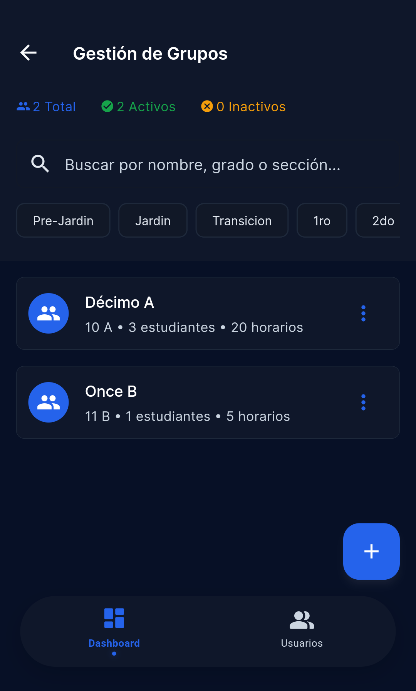

**Funcionalidades:**
- **Búsqueda:** Por nombre, grado o sección
- **Filtros:** Chips de filtro rápido por grado (10mo, 11mo, Pre-Jardín, etc.)
- **Estadísticas:** Total de grupos, activos e inactivos

**Para crear un grupo:**
1. Presione el botón **"+"**
2. Complete:
   - Nombre del grupo (ej: "10-A")
   - Grado (ej: "10mo")
   - Sección (opcional, ej: "A")
   - Período académico
3. Presione **"Crear"**

**Detalle del grupo:**
Al tocar un grupo, accede a la vista detallada con dos secciones:

*Estudiantes asignados:*
- Lista de estudiantes que pertenecen al grupo
- Botón de **remover** (ícono rojo) para desasignar estudiante
- Confirmación requerida antes de remover

*Asignar nuevos estudiantes:*
- Presione el botón flotante **"+"** para abrir el diálogo
- Búsqueda por nombre o identificación
- Lista de estudiantes sin grupo asignado
- Selección múltiple con checkboxes
- Botón **"Asignar seleccionados"**

### 5.4 Gestión de Horarios

Configure el calendario semanal de clases para cada grupo.

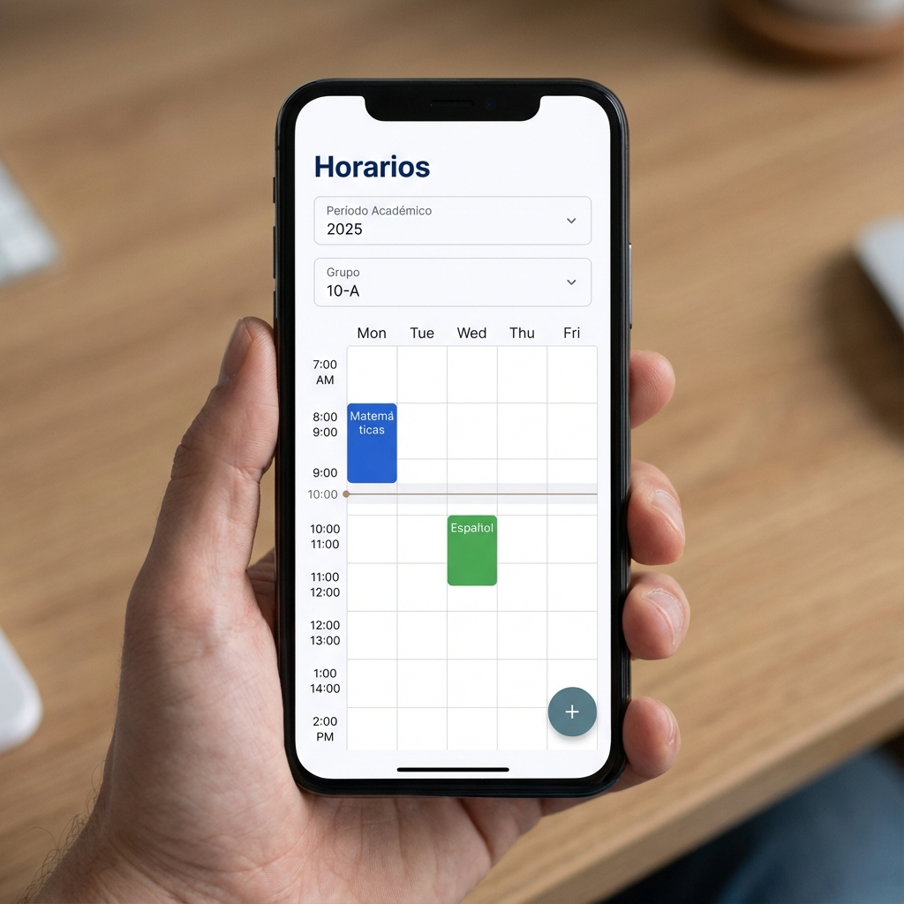

**Uso del calendario:**
1. **Seleccione el Período Académico** en el dropdown superior
2. **Seleccione el Grupo** a visualizar
3. El calendario muestra la semana con las clases asignadas

**Para crear una clase:**
1. Presione el botón **"+"** o toque una celda vacía del calendario
2. Complete el formulario:
   - **Hora de fin:** Seleccione en intervalos de 30 minutos
   - **Materia:** Lista de materias activas de la institución
   - **Profesor:** Solo muestra profesores disponibles en ese horario
3. Presione **"Crear Clase"**

> **Nota:** Si hay conflicto de horario (profesor ocupado o grupo tiene clase), se mostrará un diálogo con sugerencias para resolverlo.

**Bloques en el calendario:**
- Cada materia tiene un color diferenciado automáticamente
- Los bloques muestran: nombre de materia, profesor y horario
- Tamaño proporcional a la duración de la clase

**Para editar una clase:**
1. Toque el bloque de la clase en el calendario
2. Modifique los campos necesarios
3. Presione **"Actualizar"** o **"Eliminar"** según corresponda

### 5.5 Gestión de Materias

Administre el catálogo de materias de la institución.

**Funcionalidades:**
- **Búsqueda:** Por nombre o código de materia
- **Filtros:** Todas / Activas / Inactivas
- **Estadísticas:** Total, con código, sin código

**Para crear una materia:**
1. Presione el botón flotante **"+"**
2. Complete:
   - Nombre de la materia
   - Código (opcional)
3. Presione **"Crear"**

**Acciones por materia:**
- Editar información
- Eliminar materia

### 5.6 Gestión de Períodos Académicos

Configure los períodos lectivos de su institución.

**Funcionalidades:**
- Lista de todos los períodos creados
- Indicador de estado (Activo/Inactivo)
- Fechas de inicio y fin visibles

**Para crear un período:**
1. Presione el botón flotante **"+"**
2. Complete:
   - Nombre del período (ej: "Año 2025", "Semestre 2025-I")
   - Fecha de inicio
   - Fecha de fin
3. Presione **"Crear"**

**Acciones por período:**
- **Activar/Desactivar:** Cambia el estado del período
- **Editar:** Modifica nombre y fechas
- **Eliminar:** Requiere confirmación (elimina grupos asociados)

> **Importante:** Los grupos deben estar asociados a un período académico activo.

### 5.7 Vinculación de Acudientes

Al editar un estudiante, puede gestionar sus acudientes vinculados.
**Panel de Gestión de Acudientes:**

El panel se abre como una pantalla inferior (bottom sheet) y muestra:
- Lista de acudientes actualmente vinculados
- Formulario para agregar nuevos acudientes

**Agregar un acudiente existente:**
1. Ingrese el **email** del acudiente en el campo de búsqueda
2. Presione **"Buscar"**
3. Si se encuentra, aparecerá la información del usuario
4. Seleccione el **parentesco** (padre, madre, tutor, abuelo, tío, hermano, otro)
5. Presione **"Vincular"**

**Crear y vincular nuevo acudiente:**
Si el email no existe en el sistema:
1. El formulario mostrará campos adicionales:
   - Nombres (requerido)
   - Apellidos (requerido)
   - Teléfono
2. Seleccione el parentesco
3. Presione **"Crear y Vincular"**
4. Se mostrará la **contraseña temporal** generada - **cópiela antes de cerrar**

**Acudientes vinculados muestran:**
- Nombre completo
- Email
- Parentesco (badge)
- Indicador "PRINCIPAL" si es el acudiente principal

**Para desvincular:**
- Presione el ícono de **cadena rota** en la tarjeta del acudiente
- Confirme la acción en el diálogo

---

## 6. Profesor

El profesor es responsable del registro diario de asistencia de sus clases.

### 6.1 Panel Principal

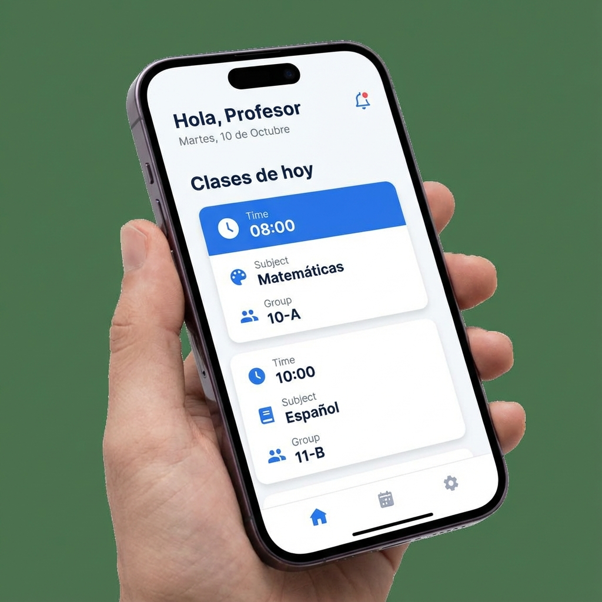

**Elementos del dashboard:**
- **Saludo personalizado** con nombre y fecha actual
- **Sección "Clases de hoy":** Lista cronológica de las clases programadas
  - Cada tarjeta muestra:
    - Hora de inicio y fin
    - Nombre de la materia
    - Grupo asignado
- **Botón de actualización** para recargar la lista

### 6.2 Toma de Asistencia

Al seleccionar una clase del dashboard, accede a la pantalla de registro de asistencia.

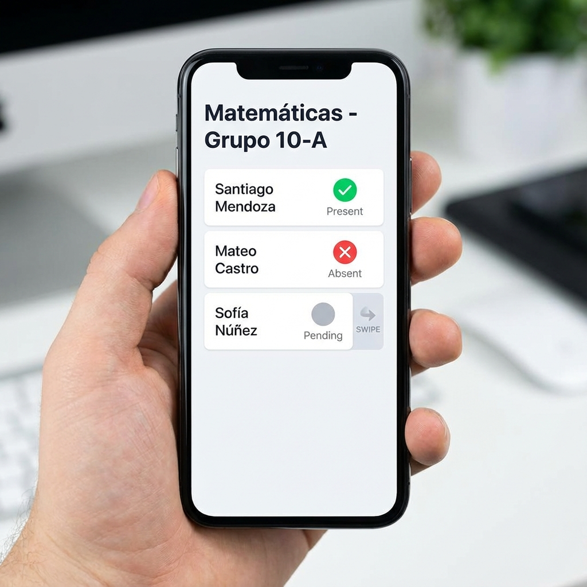

**Información de la clase:**
- Nombre de la materia y grupo
- Horario de la clase
- Indicador del modo de notificación configurado

**Lista de estudiantes:**
Cada estudiante muestra:
- Inicial y nombre completo
- Número de identificación
- Estado actual de asistencia (chip de color)

**Métodos de registro:**

1. **Gestos deslizantes (Swipe):**
   - 👉 **Deslizar a la derecha:** Marcar como **PRESENTE** (fondo verde)
   - 👈 **Deslizar a la izquierda:** Marcar como **AUSENTE** (fondo rojo)

2. **Toque manual:**
   - Toque una vez para seleccionar el estudiante
   - Toque nuevamente para confirmar el registro como presente

3. **Botón de edición:**
   - Presione el ícono de lápiz para abrir el menú de estados:
     - Presente
     - Ausente
     - Tardanza
     - Justificado
   - Agregue observaciones si es necesario

4. **Selección múltiple:**
   - Mantenga presionado un estudiante para activar el modo multi-selección
   - Seleccione varios estudiantes
   - Aplique el mismo estado a todos a la vez

5. **Escaneo QR:**
   - Presione el ícono de escáner en la barra superior
   - Apunte la cámara al código QR del estudiante
   - Use el botón de **linterna** (ícono de flash) para mejorar la iluminación si es necesario
   - El sistema registra automáticamente la asistencia como "PRESENTE"
   - Se muestra confirmación visual con el nombre del estudiante

**Estadísticas en tiempo real:**
- Presentes / Ausentes / Sin registrar
- Porcentaje de asistencia de la clase

**Indicador de notificaciones:**
En la parte superior de la pantalla se muestra el modo de notificación configurado:
- **INSTANT:** Las notificaciones se envían inmediatamente al registrar una ausencia
- **END_OF_DAY:** Las notificaciones se envían al final del día (hora configurada)
- **MANUAL_ONLY:** Requiere activación manual

**Notificaciones manuales (modo MANUAL_ONLY):**
Si la institución tiene configurado el modo manual:
- Presione el ícono de megáfono
- Seleccione el alcance:
  - Última clase
  - Último día
  - Última semana
- Las notificaciones se enviarán a los acudientes vía WhatsApp y/o Push

---

## 7. Estudiante

Los estudiantes pueden consultar su información académica y facilitar su registro de asistencia.

### 7.1 Panel Principal

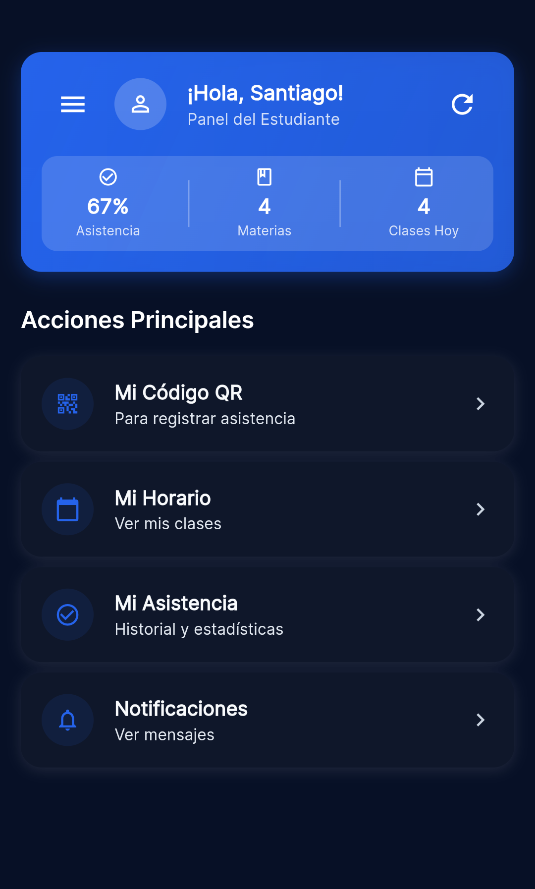

**Elementos del dashboard:**
- **Saludo personalizado**
- **Barra de estadísticas:**
  - Porcentaje de Asistencia (con color según nivel: verde >80%, amarillo 60-80%, rojo <60%)
  - Clases del día actual
  - Total de materias inscritas
- **Acciones principales:**
  - Mi Código QR
  - Mi Horario
  - Mi Asistencia
  - Notificaciones

### 7.2 Mi Código QR

Muestre su código QR personal para el registro de asistencia por escaneo.

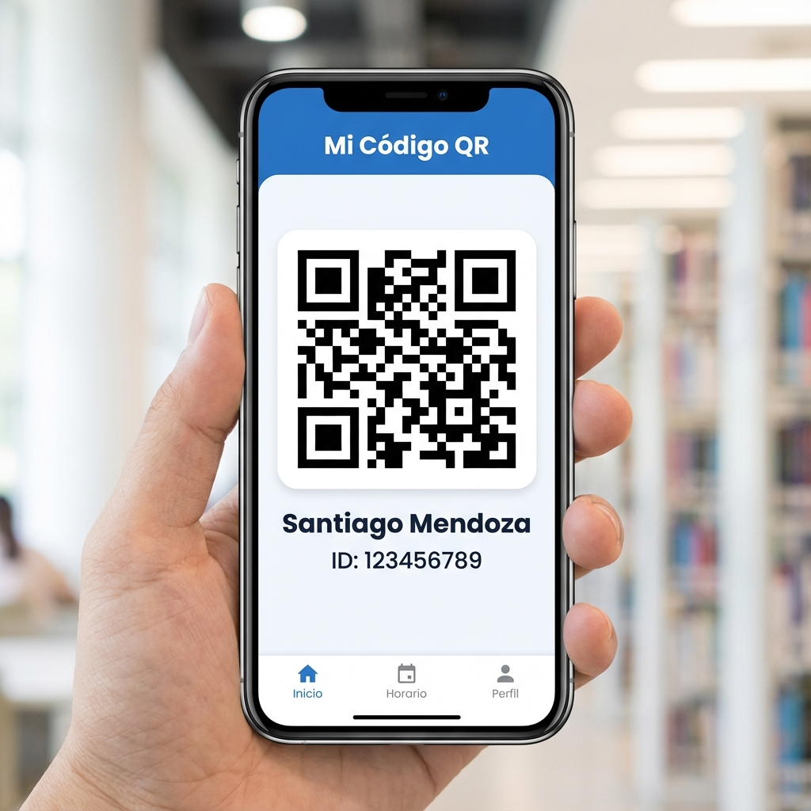

**Uso:**
1. Acceda a la sección **"Mi Código QR"**
2. Muestre el código al profesor cuando indique
3. El profesor escanea el código con su dispositivo
4. Su asistencia queda registrada automáticamente

> **Importante:** El código QR es único e intransferible. No lo comparta con otros estudiantes.

### 7.3 Mi Horario

Consulte su horario semanal de clases:
- Vista de calendario con días y horas
- Cada bloque muestra materia y profesor

### 7.4 Mi Asistencia

Revise su historial de asistencia:
- Estadísticas generales por período
- Detalle por materia
- Registro de ausencias y tardanzas

### 7.5 Notificaciones

Centro de mensajes con:
- Alertas de ausencias registradas
- Notificaciones del sistema
- Comunicados institucionales

---

## 8. Acudiente (Padre/Tutor)

Los acudientes pueden monitorear la asistencia de sus hijos y recibir notificaciones.

### 8.1 Panel Principal

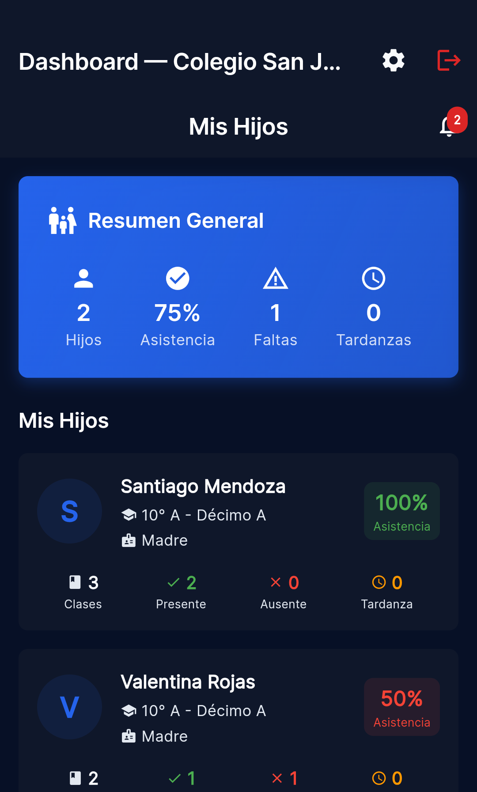

**Elementos del dashboard:**
- **Título:** "Mis Hijos"
- **Ícono de notificaciones:** Muestra badge rojo con cantidad de no leídas
- **Tarjeta de resumen general:**
  - Número de hijos vinculados
  - Promedio de asistencia
  - Total de faltas
  - Total de tardanzas
- **Lista de hijos:** Tarjeta por cada estudiante vinculado

**Información por hijo:**
- Nombre completo
- Grado y sección
- Parentesco
- Porcentaje de asistencia individual
- Estadísticas: Clases, Presentes, Ausentes, Tardanzas

### 8.2 Detalle del Estudiante

Al tocar la tarjeta de un hijo, accede a una pantalla con **dos pestañas**:

**Pestaña "Estadísticas":**
- Porcentaje de asistencia general (indicador grande con color)
- Desglose: Total clases, Presente, Ausente, Tardanza
- Asistencia por materia con porcentaje individual
- Lista de últimas inasistencias

**Pestaña "Historial":**
- Lista cronológica de todos los registros de asistencia
- Cada registro muestra:
  - Materia
  - Fecha y hora
  - Estado (con color indicativo)
  - Nombre del profesor

### 8.3 Notificaciones In-App

Acceda al centro de notificaciones desde el ícono de campana en el dashboard.

**Funcionalidades:**
- Lista de todas las notificaciones recibidas
- Indicador de **no leídas** (punto azul)
- Botón **"Marcar todas"** para leer todas las notificaciones
- **Deslizar para eliminar** notificaciones individuales

**Tipos de notificación:**
- ⚠️ **Ausencia:** Ícono rojo cuando se registra una falta
- 🕐 **Tardanza:** Ícono naranja para llegadas tarde
- ✅ **Justificado:** Ícono verde cuando se justifica una falta
- ℹ️ **Sistema:** Ícono azul para avisos generales

**Canales de notificación externos:**
Según la configuración de la institución:
- **Push:** Notificación en el dispositivo móvil
- **WhatsApp:** Mensaje al número registrado
- **Ambos:** Push + WhatsApp simultáneamente

---

## 9. Configuración y Ajustes

### Pantalla de Ajustes

Acceda desde el menú principal para personalizar la aplicación:

**Sección "Apariencia":**
- **Tema Oscuro:** Active/desactive el tema oscuro de la aplicación

**Sección "Desarrollo" (solo Super Admin):**
- **Mostrar Usuarios de Prueba:** Habilita usuarios de prueba en la pantalla de login (solo para desarrollo)

**Información:**
- Versión de la aplicación
- Información del desarrollador

**Cerrar Sesión:**
Presione el botón rojo para salir de su cuenta de forma segura.

---

## 10. Preguntas Frecuentes

### ¿Qué hago si olvidé mi contraseña?
Contacte al administrador de su institución para que restablezca su contraseña.

### ¿Por qué no recibo notificaciones de WhatsApp?
Verifique que:
1. Su número de teléfono esté registrado correctamente
2. La institución tenga activas las notificaciones por WhatsApp
3. Su número esté verificado en el sistema

### ¿Puedo cambiar mi código QR?
No, el código QR está vinculado a su identificación única en el sistema. Si necesita regenerarlo, contacte al administrador.

### ¿Cómo justifico una ausencia?
El profesor puede cambiar el estado de "Ausente" a "Justificado" al editar el registro de asistencia. Proporcione la documentación necesaria a la institución.

### ¿Por qué no veo mis clases del día?
Verifique que:
1. Esté en el día correcto (la app muestra clases del día actual)
2. Tenga horarios asignados por el administrador
3. Actualice la pantalla deslizando hacia abajo

### ¿Cómo selecciono una institución si administro varias?
Si tiene acceso a múltiples instituciones, verá una pantalla de selección después de iniciar sesión. Elija la institución con la que desea trabajar y presione "Continuar".

### ¿Cómo vinculo un acudiente a un estudiante?
1. Acceda a **Usuarios** desde el dashboard del administrador
2. Seleccione el estudiante
3. Presione **"Gestionar Acudientes"**
4. Seleccione el acudiente de la lista y el parentesco
5. Presione **"Vincular"**

### ¿Por qué no veo la opción de notificaciones manuales?
La institución debe tener configurado el modo de notificación "Manual (MANUAL_ONLY)". Si usa modo "Inmediato" o "Fin del día", las notificaciones se envían automáticamente.

---

## Soporte

Si tiene problemas técnicos o consultas adicionales:

1. **Contacte al Administrador** de su institución
2. **Verifique actualizaciones** de la aplicación en Play Store/App Store
3. **Reinicie la aplicación** si experimenta errores

---

*AsistApp - Sistema de Registro de Asistencia Escolar*  
*© 2025 - Todos los derechos reservados*
